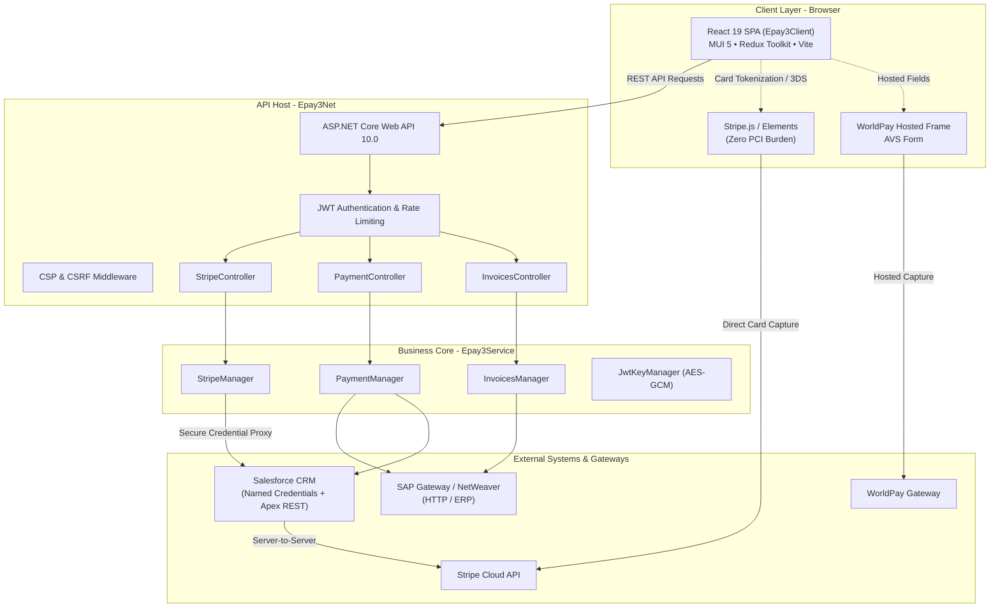
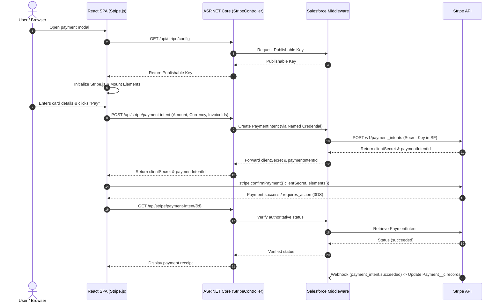

# 💳 ePay3 — ChronarPay Enterprise Payment Portal

[](https://dotnet.microsoft.com/)
[](https://react.dev/)
[](https://www.typescriptlang.org/)
[](https://vitejs.dev/)
[](https://mui.com/)
[](#-payment-gateways--integrations)
[](#-payment-gateways--integrations)

ePay3 is the standard **ChronarPay enterprise customer payment portal**. It provides a secure, full-stack payment experience for SAP- and Salesforce-backed customer workflows: invoice presentment and search, one-off and guest payments, stored payment methods, AutoPay scheduling, account management, and an administration configuration console.

---

## 📑 Table of Contents

- [Architectural Overview](#-architectural-overview)
- [Tech Stack](#-tech-stack)
- [Solution Layout](#-solution-layout)
- [Payment Gateways & Integrations](#-payment-gateways--integrations)
  - [Stripe Integration Architecture](#stripe-integration-architecture)
  - [WorldPay Integration](#worldpay-integration)
  - [SAP & Salesforce Integrations](#sap--salesforce-integrations)
- [Getting Started](#-getting-started)
  - [Prerequisites](#prerequisites)
  - [1. Clone & Restore](#1-clone--restore)
  - [2. Environment Configuration](#2-environment-configuration)
  - [3. Running Locally](#3-running-locally)
- [Testing & Quality Assurance](#-testing--quality-assurance)
- [Security & Governance](#-security--governance)
- [Branching & Release Workflow](#-branching--release-workflow)

---

## 🏛 Architectural Overview



---

## 🧱 Tech Stack

| Layer | Technology | Details |
| :--- | :--- | :--- |
| **Runtime** | .NET 10 (`net10.0`) | SDK pinned in `global.json` (`10.0.100`, `rollForward: latestFeature`) |
| **Backend API** | ASP.NET Core 10 (`Epay3Net`) | REST endpoints, JWT bearer auth with cookie fallback, CSP/CSRF pipelines, rate limiting |
| **Service Layer** | .NET Class Library (`Epay3Service`) | Business managers, SAP client, Salesforce client, payment policies, AutoMapper profiles |
| **Frontend** | React 19 + TypeScript 5.9 | Vite 8 bundler, Node `>= 24.0.0` |
| **UI & Styling** | MUI 5 + Emotion | `@mui/material`, `@mui/x-date-pickers`, `@fontsource-variable/inter`, `react-payment-logos` |
| **State & Routing** | Redux Toolkit & React Router 8 | Centralized slice state, asynchronous thunks, nested route structure |
| **Payment Gateways** | Stripe + WorldPay | Stripe.js Elements (modern tokenization) & WorldPay (AVS / hosted frames) |
| **Backing ERP / CRM** | SAP & Salesforce | SAP via `SapHttpClient`, Salesforce via `SalesforceHttpClient` (OAuth2 token exchange) |
| **Testing** | xUnit, Moq | Comprehensive backend tests under `Tests/` |
| **Security Tooling** | OSV-Scanner, Prettier, ESLint | Dependency vulnerability auditing, husky pre-commit enforcement |

---

## 📁 Solution Layout

```text
epay3/
├── Epay3Net/                      # ASP.NET Core Host & Web API (Entry Point)
│   ├── Controllers/               # API Controllers (Stripe, Payment, Invoices, Auth, Config, etc.)
│   ├── Authorization/             # Policy-based abilities and role gating
│   ├── Middleware/                # Pipeline filters (Security headers, CSP, CSRF, error handling)
│   ├── BackgroundServices/        # Background tasks (JWT key rotation, scheduled cleanups)
│   ├── RateLimiting/              # Endpoint throttling partitions (Auth, Guest Payments)
│   ├── HealthChecks/              # Liveness and readiness endpoints (API, SAP)
│   ├── appsettings.json           # Application settings & feature flags
│   └── Program.cs                 # Dependency injection and application bootstrapping
│
├── Epay3Service/                  # Core Business Domain & External Integrations
│   ├── Clients/                   # SapHttpClient, SalesforceHttpClient, WorldPayClient
│   ├── Managers/                  # StripeManager, PaymentManager, InvoicesManager, AuthManager, etc.
│   ├── Payments/                  # Payment policy enforcement and rules
│   ├── DTOs/ & Models/            # Domain models and transfer contracts
│   └── MappingProfile.cs          # AutoMapper configurations
│
├── Epay3Client/                   # Single Page Application (React 19 + Vite)
│   ├── src/
│   │   ├── components/            # Reusable UI components, cards, navigation, dialogs
│   │   ├── stripe/                # Stripe Elements form, loader, hooks (useStripePayment)
│   │   ├── redux/                 # Redux Toolkit store, slices, and selectors
│   │   ├── services/              # API clients and HTTP transport wrappers
│   │   ├── types/                 # TypeScript type and interface definitions
│   │   └── routing/               # React Router routes and guarded navigation
│   ├── package.json               # Frontend dependencies and build scripts
│   └── vite.config.ts             # Vite configuration and proxy setup
│
├── Tests/                         # Test Suites
│   ├── Epay3Net.Tests/            # Controller, authorization, and security tests
│   ├── Epay3Service.Tests/        # Manager, policy, and integration client tests
│   └── Epay3.Test.Common/         # Mock fixtures, test stubs, and synthetic data
│
└── scripts/                       # Automation and security reporting scripts
```

---

## 💳 Payment Gateways & Integrations

### Stripe Integration Architecture

The application implements a secure, PCI-compliant Stripe payment flow using **Stripe Elements** on the frontend and **Salesforce Named Credentials** as a middleware mediator.

> [!IMPORTANT]
> **Zero PCI Scope on .NET Host:**
> - Stripe secret keys **never** enter or touch the ASP.NET Core API.
> - Secret keys are secured within Salesforce Named Credentials.
> - Payment card data flows directly from the customer browser (`Stripe.js`) to Stripe's secure infrastructure.



### WorldPay Integration

- **AVS Verification:** Address verification through `WorldPayAddressValidationServiceClient`.
- **Hosted Frame Capture:** Card tokens generated through WorldPay hosted fields to maintain PCI-DSS compliance.

### SAP & Salesforce Integrations

- **SAP ERP:** `SapHttpClient` coordinates real-time open invoice retrieval, account validation, payment postings, and deposit clearing.
- **Salesforce CRM:** `SalesforceHttpClient` manages OAuth2 Bearer token lifecycle, customer account mappings, AutoPay enrollments, and payment history synchronization.

---

## 🚀 Getting Started

### Prerequisites

- **[.NET SDK 10.0.100+](https://dotnet.microsoft.com/download/dotnet/10.0)** (Strict requirement; declared in `global.json`)
- **[Node.js](https://nodejs.org/) `>= 24.0.0`** and **npm `>= 10.8.0`**
- **IDE:** Visual Studio 2022+ / Rider / VS Code with C# Dev Kit

### 1. Clone & Restore

```bash
# Clone the repository
git clone https://github.com/<YOUR-ORGANIZATION>/epay3.git
cd epay3

# Restore backend dependencies
dotnet restore Epay3Net.sln

# Restore frontend dependencies
cd Epay3Client
npm install
cd ..
```

### 2. Environment Configuration

Application secrets and sensitive credentials are read from environment variables (or `launchSettings.json` in local development, which is git-ignored).

Create or update your local environment variables with the required values:

| Variable | Description | Required | Example |
| :--- | :--- | :---: | :--- |
| `ASPNETCORE_ENVIRONMENT` | Runtime environment name | Yes | `Development` |
| `ASPNETCORE_HOSTINGSTARTUPASSEMBLIES` | Enables SPA dev proxy integration | Yes | `Microsoft.AspNetCore.SpaProxy` |
| `CP_KEK` | Root key-encryption key for AES-GCM JWT signing keys | Yes | `Base64StringKey...` |
| `JWT_KEY_PREFIX` | Namespace prefix for JWT keys (prevents multi-env collisions) | Yes | `LOCAL_` / `DEV_` |
| `KEY_ROTATION_DURATION` | Automatic JWT signing key rotation interval | No | `1h` (default: 24h) |
| `SAP_URL` | Base endpoint for the SAP Gateway | Yes | `https://sap-gateway.example.com` |
| `SAP_USER` / `SAP_PASSWORD` | SAP service account credentials | Yes | — |
| `SAP_CLIENT_ID` / `SAP_API_ID`| SAP client identifier and mandant | Yes | `100` / `EPAY_API` |
| `SAP_HEADERS_CNBSSYSID` | System encryption ID sent with every SAP transaction | Yes | — |
| `SALESFORCE_INSTANCE_URL` | Salesforce organization base URL | Yes | `https://yourinstance.my.salesforce.com` |
| `SALESFORCE_TOKEN_URL` | Salesforce OAuth2 token endpoint | Yes | `https://login.salesforce.com/services/oauth2/token` |
| `SALESFORCE_CLIENT_ID` | Connected App Client ID | Yes | — |
| `SALESFORCE_CLIENT_SECRET` | Connected App Client Secret | Yes | — |

### 3. Running Locally

#### Unified Mode (Backend + SPA dev proxy)

Running the .NET project automatically launches the SPA Vite development server:

```powershell
dotnet run --project Epay3Net/Epay3Net.csproj
```

#### Standalone Frontend Development

If you prefer hot-module reloading and independent frontend development:

```powershell
# Terminal 1: Backend API
dotnet run --project Epay3Net/Epay3Net.csproj

# Terminal 2: React SPA
cd Epay3Client
npm start
```

| Service | Address |
| :--- | :--- |
| **API Endpoint (HTTPS)** | `https://localhost:7121` |
| **API Endpoint (HTTP)** | `http://localhost:5005` |
| **SPA Dev Server** | `https://localhost:44411` |
| **Health Checks** | `https://localhost:7121/health` |

---

## 🧪 Testing & Quality Assurance

Always validate your changes before pushing or opening a pull request:

```powershell
# Run all backend unit tests
dotnet test

# Run focused test projects
dotnet test Tests/Epay3Net.Tests/Epay3Net.Tests.csproj
dotnet test Tests/Epay3Service.Tests/Epay3Service.Tests.csproj

# Generate code coverage report
.\generate_coverage.ps1
```

```powershell
# Frontend linting, formatting & type checking
cd Epay3Client
npm run format     # Prettier formatting
npm run lint       # ESLint rules check
npm run build      # TypeScript validation (tsc --noEmit) & Vite production build
```

---

## 🔒 Security & Governance

- **PCI-DSS Compliance:** Cardholder data never passes through backend web servers. Stripe Elements and WorldPay hosted iFrames securely handle sensitive card numbers directly with the respective payment processors.
- **Key-Encryption Key (KEK) Rotation:** Application JWT keys are encrypted at rest using AES-GCM and stored in SAP/Salesforce, dynamically rotated via `JwtKeyRotationService`.
- **Content Security Policy (CSP):** Strict CSP headers configured in `CspSettings`. All third-party endpoints (e.g., Stripe, analytics) must be explicitly whitelisted.
- **Rate Limiting:** IP-partitioned rate limits on sensitive authentication (`/api/auth/*`) and guest payment endpoints (`/api/guestpayment/*`).
- **Dependency Auditing:** Continuous OSV-Scanner checks (`.\Run-OsvScan.ps1`) audit for known vulnerabilities in lockfiles.

---

## 🔀 Branching & Release Workflow

| Branch | Purpose | Merge Policy |
| :--- | :--- | :--- |
| `main` | Production-ready baseline standard codebase | Protected; Pull Request with review |
| `release/vX.Y.Z` | Feature development line for targeted release versions | Active sprint branch |
| `baseline/X.Y.Z` | Frozen client-baselined release snapshots (e.g. JnJ, Medtronic, Davey) | Level maintenance fixes only |
| `feature/*`, `fix/*` | Short-lived branch for individual stories and bug fixes | Delete upon merge |

---

## 📄 License

Proprietary and confidential. Copyright © ChronarPay. All rights reserved.
