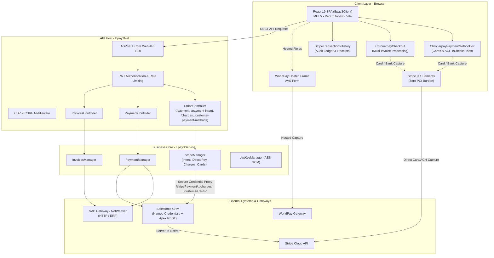
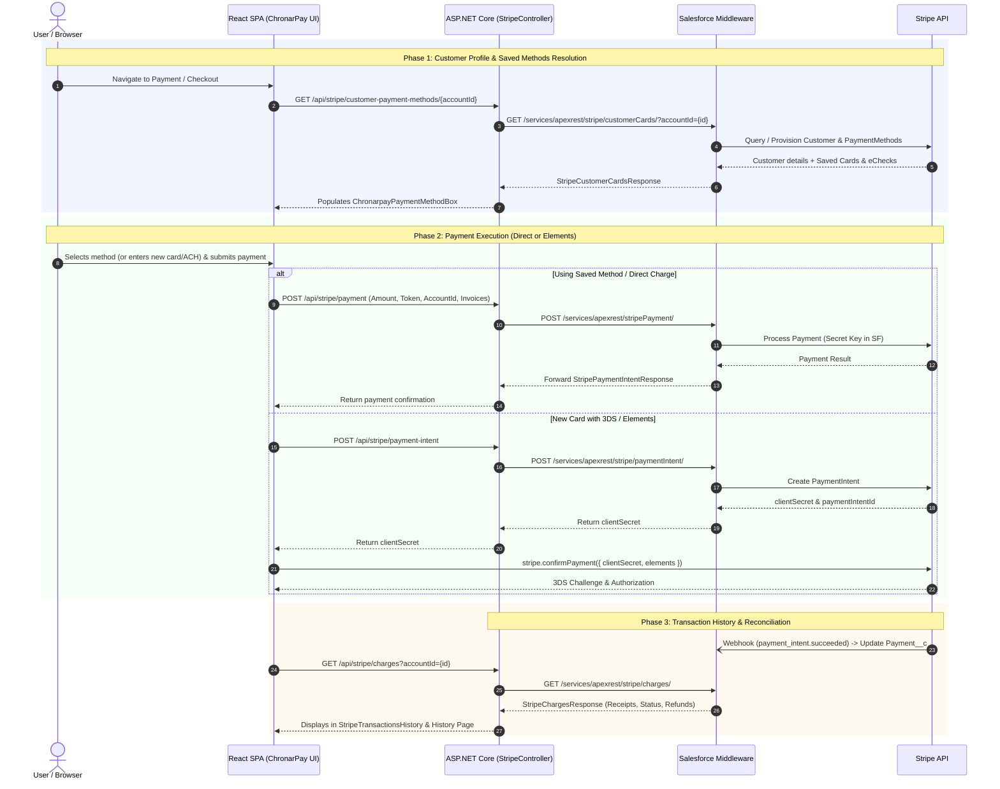

# 💳 ePay3 — ChronarPay Enterprise Payment Portal

[](https://dotnet.microsoft.com/)
[](https://react.dev/)
[](https://www.typescriptlang.org/)
[](https://vitejs.dev/)
[](https://mui.com/)
[](#-payment-gateways--integrations)
[](#-payment-gateways--integrations)

ePay3 is the standard **ChronarPay enterprise customer payment portal**. It provides a secure, full-stack payment experience for SAP- and Salesforce-backed customer workflows: invoice presentment and search, one-off and guest payments, stored payment methods, AutoPay scheduling, account management, and an administration configuration console.

---

## 📑 Table of Contents

- [Architectural Overview](#-architectural-overview)
- [Tech Stack](#-tech-stack)
- [Solution Layout](#-solution-layout)
- [Payment Gateways & Integrations](#-payment-gateways--integrations)
  - [Stripe Integration Architecture](#stripe-integration-architecture)
  - [Stripe API Endpoints](#stripe-api-endpoints)
  - [ACH & US Bank Account (eCheck) Support](#ach--us-bank-account-echeck-support)
  - [ChronarPay Modern Payment Experience](#chronarpay-modern-payment-experience)
  - [Payment History & Multi-Source Reconciliation](#payment-history--multi-source-reconciliation)
  - [WorldPay Integration](#worldpay-integration)
  - [SAP & Salesforce Integrations](#sap--salesforce-integrations)
- [Getting Started](#-getting-started)
  - [Prerequisites](#prerequisites)
  - [1. Clone & Restore](#1-clone--restore)
  - [2. Environment Configuration](#2-environment-configuration)
  - [3. Running Locally](#3-running-locally)
- [Testing & Quality Assurance](#-testing--quality-assurance)
- [Security & Governance](#-security--governance)
- [Branching & Release Workflow](#-branching--release-workflow)

---

## 🏛 Architectural Overview


```mermaid
flowchart TB
    subgraph ClientLayer [Client Layer - Browser]
        ReactSPA["React 19 SPA (Epay3Client)<br/>MUI 5 • Redux Toolkit • Vite"]
        ChronarBox["ChronarpayPaymentMethodBox<br/>(Cards & ACH eChecks Tabs)"]
        ChronarCheckout["ChronarpayCheckout<br/>(Multi-Invoice Processing)"]
        StripeHist["StripeTransactionsHistory<br/>(Audit Ledger & Receipts)"]
        StripeJS["Stripe.js / Elements<br/>(Zero PCI Burden)"]
        WorldpayFrame["WorldPay Hosted Frame<br/>AVS Form"]
    end

    subgraph HostLayer [API Host - Epay3Net]
        API["ASP.NET Core Web API 10.0"]
        AuthMiddleware["JWT Authentication & Rate Limiting"]
        CSPMiddleware["CSP & CSRF Middleware"]
        StripeCtrl["StripeController<br/>(/payment, /payment-intent, /charges, /customer-payment-methods)"]
        PaymentCtrl["PaymentController"]
        InvoiceCtrl["InvoicesController"]
    end

    subgraph ServiceLayer [Business Core - Epay3Service]
        StripeMgr["StripeManager<br/>(Intent, Direct Pay, Charges, Cards)"]
        PaymentMgr["PaymentManager"]
        InvoiceMgr["InvoicesManager"]
        JwtMgr["JwtKeyManager (AES-GCM)"]
    end

    subgraph ExternalServices [External Systems & Gateways]
        SF["Salesforce CRM<br/>(Named Credentials + Apex REST)"]
        SAP["SAP Gateway / NetWeaver<br/>(HTTP / ERP)"]
        StripeAPI["Stripe Cloud API"]
        WorldpayAPI["WorldPay Gateway"]
    end

    %% Client Layer internal relationships
    ReactSPA --> ChronarBox & ChronarCheckout & StripeHist
    ChronarBox -.->|Card / Bank Capture| StripeJS
    ChronarCheckout -.->|Card / Bank Capture| StripeJS
    ReactSPA -.->|Hosted Fields| WorldpayFrame

    %% Client to API
    ReactSPA -->|REST API Requests| API

    %% API Routing
    API --> AuthMiddleware --> StripeCtrl & PaymentCtrl & InvoiceCtrl

    %% Controllers to Managers
    StripeCtrl --> StripeMgr
    PaymentCtrl --> PaymentMgr
    InvoiceCtrl --> InvoiceMgr

    %% Direct Gateway calls from browser
    StripeJS -->|Direct Card/ACH Capture| StripeAPI
    WorldpayFrame -->|Hosted Capture| WorldpayAPI

    %% Service to external integrations
    StripeMgr -->|Secure Credential Proxy<br/>/stripePayment/, /charges/, /customerCards/| SF
    SF -->|Server-to-Server| StripeAPI
    PaymentMgr --> SAP & SF
    InvoiceMgr --> SAP
```

---

## 🧱 Tech Stack

| Layer | Technology | Details |
| :--- | :--- | :--- |
| **Runtime** | .NET 10 (`net10.0`) | SDK pinned in `global.json` (`10.0.100`, `rollForward: latestFeature`) |
| **Backend API** | ASP.NET Core 10 (`Epay3Net`) | REST endpoints, JWT bearer auth with cookie fallback, CSP/CSRF pipelines, rate limiting |
| **Service Layer** | .NET Class Library (`Epay3Service`) | Business managers, SAP client, Salesforce client, payment policies, AutoMapper profiles |
| **Frontend** | React 19 + TypeScript 5.9 | Vite 8 bundler, Node `>= 24.0.0` |
| **UI & Styling** | MUI 5 + Emotion | `@mui/material`, `@mui/x-date-pickers`, `@fontsource-variable/inter`, `react-payment-logos` |
| **State & Routing** | Redux Toolkit & React Router 8 | Centralized slice state, asynchronous thunks, nested route structure |
| **Payment Gateways** | Stripe + WorldPay | Stripe.js Elements (modern card & ACH eCheck tokenization) & WorldPay (AVS / hosted frames) |
| **Backing ERP / CRM** | SAP & Salesforce | SAP via `SapHttpClient`, Salesforce via `SalesforceHttpClient` (OAuth2 token exchange) |
| **Testing** | xUnit, Moq | Comprehensive backend tests under `Tests/` |
| **Security Tooling** | OSV-Scanner, Prettier, ESLint | Dependency vulnerability auditing, husky pre-commit enforcement |

---

## 📁 Solution Layout

```text
epay3/
├── Epay3Net/                      # ASP.NET Core Host & Web API (Entry Point)
│   ├── Controllers/               # API Controllers (Stripe, Payment, Invoices, Auth, Config, etc.)
│   │   └── StripeController.cs    # PaymentIntent, direct payment, charges history, customer payment methods
│   ├── Authorization/             # Policy-based abilities and role gating
│   ├── Middleware/                # Pipeline filters (Security headers, CSP, CSRF, error handling)
│   ├── BackgroundServices/        # Background tasks (JWT key rotation, scheduled cleanups)
│   ├── RateLimiting/              # Endpoint throttling partitions (Auth, Guest Payments)
│   ├── HealthChecks/              # Liveness and readiness endpoints (API, SAP)
│   ├── appsettings.json           # Application settings, feature flags & Salesforce REST paths
│   └── Program.cs                 # Dependency injection and application bootstrapping
│
├── Epay3Service/                  # Core Business Domain & External Integrations
│   ├── Clients/                   # SapHttpClient, SalesforceHttpClient, WorldPayClient
│   ├── Managers/                  # StripeManager, PaymentManager, InvoicesManager, AuthManager, etc.
│   │   ├── Interfaces/IStripeManager.cs
│   │   └── StripeManager.cs       # Salesforce Apex proxy orchestration (Payments, Charges, Customer Cards)
│   ├── Payments/                  # Payment policy enforcement and rules
│   ├── DTOs/                      # Data Transfer Objects
│   │   ├── StripeChargesResponse.cs       # Charges list, card/bank details, refunds, receipts
│   │   ├── StripeCustomerCardsResponse.cs # Customer cards, ACH bank accounts, billing profiles
│   │   ├── StripePaymentIntentRequest.cs  # Payment payload contract (supporting WorldPay parity)
│   │   └── StripePaymentIntentResponse.cs # Authorization and settlement status contracts
│   ├── Models/                    # Domain models and SAP/SF entities (PaymentInvoice, etc.)
│   └── MappingProfile.cs          # AutoMapper configurations
│
├── Epay3Client/                   # Single Page Application (React 19 + Vite)
│   ├── src/
│   │   ├── components/            # Reusable UI components, cards, navigation, dialogs
│   │   │   ├── cards/
│   │   │   │   ├── PaymentMethodModal.tsx  # Modal container for card & check onboarding
│   │   │   │   └── stripe/
│   │   │   │       ├── AddCardStripe.tsx   # Stripe Card Element modal
│   │   │   │       ├── AddCheckStripe.tsx  # Stripe ACH / eCheck bank account modal
│   │   │   │       └── AddCheckStripe.css  # ACH modal styling
│   │   │   ├── payment/
│   │   │   │   ├── ChronarpayPaymentMethodBox.tsx # Tabbed Cards & eChecks selector with brand recognition
│   │   │   │   ├── Payments.tsx                   # Main invoice payment orchestration view
│   │   │   │   └── PaymentTotalsSummary.tsx       # Line-item totals and fee summaries
│   │   │   ├── payments/
│   │   │   │   ├── PaymentHistory.tsx              # Payment history container
│   │   │   │   ├── PaymentHistoryFilterSelectors.tsx # Search and date range selectors
│   │   │   │   └── paymentHistory/
│   │   │   │       └── usePaymentHistoryData.ts   # Reconciled multi-source payment history hook
│   │   │   └── settings/payment/
│   │   │       └── ManagePaymentMethodsPage.tsx   # Stored payment methods management & Stripe card sync
│   │   ├── stripe/                # Stripe Elements integration
│   │   │   ├── ChronarpayCheckout.tsx         # Multi-invoice checkout experience
│   │   │   ├── StripeTransactionsHistory.tsx  # Standalone Stripe charges audit table & receipts
│   │   │   ├── useStripePayment.ts            # Stripe payment hook
│   │   │   └── stripeLoader.ts                # Lazy Stripe.js loader
│   │   ├── redux/                 # Redux Toolkit store, slices, and selectors
│   │   ├── services/              # API clients and HTTP transport wrappers
│   │   ├── types/                 # TypeScript type and interface definitions
│   │   └── routing/               # React Router routes and guarded navigation
│   ├── package.json               # Frontend dependencies and build scripts
│   └── vite.config.ts             # Vite configuration and proxy setup
│
├── Tests/                         # Test Suites
│   ├── Epay3Net.Tests/            # Controller, authorization, and security tests
│   ├── Epay3Service.Tests/        # Manager, policy, and integration client tests
│   └── Epay3.Test.Common/         # Mock fixtures, test stubs, and synthetic data
│
└── scripts/                       # Automation and security reporting scripts
```

---

## 💳 Payment Gateways & Integrations

### Stripe Integration Architecture

The application implements an enterprise, PCI-compliant Stripe payment architecture using **Stripe Elements** on the frontend and **Salesforce Named Credentials** as the secure server-side mediator.

> [!IMPORTANT]
> **Zero PCI Scope on .NET Host:**
> - Stripe secret keys **never** enter or touch the ASP.NET Core API.
> - Secret keys are secured exclusively within Salesforce Named Credentials.
> - Card and bank account credentials flow directly from the customer browser (`Stripe.js`) to Stripe's secure infrastructure.
> - Stored tokens (`pm_*` or `tok_*`) or customer IDs (`cus_*`) are referenced during payment execution.

#### Dual Execution Modes

1. **Session & Stripe Elements Flow (`/api/stripe/payment-intent`):**
   - Ideal for interactive UI flows requiring real-time card validation and 3D Secure / SCA challenges.
   - ASP.NET requests a PaymentIntent via Salesforce Apex REST `/services/apexrest/stripe/paymentIntent/`.
   - The frontend mounts Stripe Elements and executes authentication via `stripe.confirmPayment()`, `stripe.confirmCardPayment()`, or `stripe.confirmUsBankAccountPayment()`.

2. **Direct Payment Flow (`/api/stripe/payment` or `/api/stripe/pay`):**
   - Mirrors the WorldPay payment API request body structure for consistency across payment providers.
   - Accepts saved payment method tokens, amounts, customer identifiers, invoice metadata, and an optional `confirm: true` flag.
   - Directly triggers charge execution through Salesforce Apex REST `/services/apexrest/stripePayment/` without requiring client-side re-confirmation when using saved payment methods.


```mermaid
sequenceDiagram
    autonumber
    actor Customer as User / Browser
    participant Client as React SPA (ChronarPay UI)
    participant NetAPI as ASP.NET Core (StripeController)
    participant SF as Salesforce Middleware
    participant Stripe as Stripe API

    %% Phase 1: Customer & Methods Resolution
    rect rgb(240, 245, 255)
    Note over Customer,Stripe: Phase 1: Customer Profile & Saved Methods Resolution
    Customer->>Client: Navigate to Payment / Checkout
    Client->>NetAPI: GET /api/stripe/customer-payment-methods/{accountId}
    NetAPI->>SF: GET /services/apexrest/stripe/customerCards/?accountId={id}
    SF->>Stripe: Query / Provision Customer & PaymentMethods
    Stripe-->>SF: Customer details + Saved Cards & eChecks
    SF-->>NetAPI: StripeCustomerCardsResponse
    NetAPI-->>Client: Populates ChronarpayPaymentMethodBox
    end

    %% Phase 2: Payment Execution
    rect rgb(245, 255, 245)
    Note over Customer,Stripe: Phase 2: Payment Execution (Direct or Elements)
    Customer->>Client: Selects method (or enters new card/ACH) & submits payment
    alt Using Saved Method / Direct Charge
        Client->>NetAPI: POST /api/stripe/payment (Amount, Token, AccountId, Invoices)
        NetAPI->>SF: POST /services/apexrest/stripePayment/
        SF->>Stripe: Process Payment (Secret Key in SF)
        Stripe-->>SF: Payment Result
        SF-->>NetAPI: Forward StripePaymentIntentResponse
        NetAPI-->>Client: Return payment confirmation
    else New Card with 3DS / Elements
        Client->>NetAPI: POST /api/stripe/payment-intent
        NetAPI->>SF: POST /services/apexrest/stripe/paymentIntent/
        SF->>Stripe: Create PaymentIntent
        Stripe-->>SF: clientSecret & paymentIntentId
        SF-->>NetAPI: Return clientSecret
        NetAPI-->>Client: Return clientSecret
        Client->>Stripe: stripe.confirmPayment({ clientSecret, elements })
        Stripe-->>Client: 3DS Challenge & Authorization
    end
    end

    %% Phase 3: Webhook & Transaction Record
    rect rgb(255, 250, 240)
    Note over NetAPI,Stripe: Phase 3: Transaction History & Reconciliation
    Stripe-)SF: Webhook (payment_intent.succeeded) -> Update Payment__c
    Client->>NetAPI: GET /api/stripe/charges?accountId={id}
    NetAPI->>SF: GET /services/apexrest/stripe/charges/
    SF-->>NetAPI: StripeChargesResponse (Receipts, Status, Refunds)
    NetAPI-->>Client: Displays in StripeTransactionsHistory & History Page
    end
```

---

### Stripe API Endpoints

The ASP.NET Core API provides a robust controller suite under `/api/stripe`:

| Method | Endpoint | Description | Auth / Policy |
| :--- | :--- | :--- | :--- |
| `GET` | `/api/stripe/config` | Retrieves the Stripe publishable key from Salesforce | Public / Rate-Limited |
| `POST` | `/api/stripe/payment` | Processes a payment directly via Salesforce Apex `/stripePayment/` (WorldPay parity) | Public / Session Checkout |
| `POST` | `/api/stripe/pay` | Alias for `/api/stripe/payment` | Public / Session Checkout |
| `POST` | `/api/stripe/payment-intent` | Creates a PaymentIntent; routes confirmed token requests to `/stripePayment/` | Authenticated |
| `GET` | `/api/stripe/payment-intent/{id}` | Fetches authoritative PaymentIntent status via Salesforce | Authenticated |
| `GET` | `/api/stripe/customer-payment-methods/{accountId}` | Resolves/provisions Stripe customer and returns saved cards & ACH accounts | Public / Session Checkout |
| `GET` | `/api/stripe/charges` | Retrieves Stripe transaction history with date range filtering (`created_gte`, `created_lte`) | Public / Authenticated |
| `POST` | `/api/stripe/refund` | Submits a refund request via Salesforce Named Credentials | Authenticated |
| `POST` | `/api/stripe/payment-method` | Creates or saves a payment method via Salesforce | Authenticated |

---

### ACH & US Bank Account (eCheck) Support

The platform includes first-class support for **Automated Clearing House (ACH) and electronic checks (eChecks)** through Stripe:

- **Add eCheck Modal (`AddCheckStripe`):**
  - Accepts account holder name, ABA routing number, account number with confirmation, account type (Checking / Savings), and entity classification (Company / Individual).
  - Enforces client-side **ABA 9-digit Routing Number Checksum Validation**:
    $$\text{Checksum} = (3(d_0 + d_3 + d_6) + 7(d_1 + d_4 + d_7) + 1(d_2 + d_5 + d_8)) \pmod{10} = 0$$
  - Includes test helper autofill (`handleFillTestDetails`) for development and QA sandboxes.
- **Verification & Settlement:**
  - Integrates with Stripe.js `confirmUsBankAccountPayment` for instant micro-deposit or Financial Connections authentication.
  - Generates secure `us_bank_account` payment method tokens mapped into user session and permanent records.

---

### ChronarPay Modern Payment Experience

The frontend UI delivers a cohesive, enterprise payment experience designed for high-volume invoice processing:

#### 1. `ChronarpayPaymentMethodBox`
- **Tabbed Interface:** Seamlessly switch between **My Cards** and **My eChecks**.
- **Automated Brand Recognition:** Displays brand badges (Visa, Mastercard, Amex, Discover, eCheck) with masked last-4 digits (`**** 1234`).
- **Live Account Customer Resolution:** Automatically loads saved payment methods for the active Salesforce Account ID upon account selection.
- **Inline CVV Validation:** Context-aware security entry that displays for credit cards with 3/4-digit AMEX detection, while automatically bypassing for bank accounts.
- **Quick Action Menu:** Three-dot context menu allows users to set default payment methods or delete saved methods.
- **Embedded Modal Integration:** Opens modern modal dialogs for adding new credit cards or ACH bank accounts on the fly.

#### 2. `ChronarpayCheckout`
- **Comprehensive Multi-Invoice Checkout:** Itemized table showing billing document numbers, reference numbers, due dates, open balances, and editable payment amounts.
- **Live Summary Totals:** Real-time recalculation of gross amount, applied discounts, processing fees, and net balance.
- **Customer Information Sync:** Pre-populates contact and billing address details from the selected Salesforce Account.
- **Dual Payment Selector:** Allows toggling between stored methods and one-off Stripe Elements input.

#### 3. `StripeTransactionsHistory`
- **Auditable Ledger:** Tabular view of all Stripe transactions associated with a customer or account.
- **Key Transaction Metrics:** Amount, formatted currency, masked payment instrument, creation date, status badges (`succeeded`, `pending`, `failed`, `refunded`), and decline reasons.
- **Direct Receipt Links:** One-click navigation to authoritative Stripe hosted receipts (`receipt_url`).
- **Search & Pagination:** Client-side filter by invoice description, customer ID, or transaction hash, with pagination controls.

#### 4. Payment Cards Synchronization
- Added an on-demand **Sync Cards** action in `ManagePaymentMethodsPage` (`/settings/payment-methods`), enabling customers and CSRs to force-refresh saved Stripe payment tokens directly from Salesforce.

---

### Payment History & Multi-Source Reconciliation

The `usePaymentHistoryData` hook delivers a unified payment history by synchronizing and reconciling:
- **Stripe Transaction Charges:** Queried directly via `/api/stripe/charges` with Unix timestamp bounds (`created_gte`, `created_lte`).
- **SAP / ERP Payment Records:** Queried via backend invoice and payment ledgers.
- **Smart Filtering:**
  - Multi-account normalizer stripping leading zeros from account identifiers.
  - Date period presets (Last 7 Days, Last 30 Days, Custom Range, All).
  - Quick Enter-key search filter across invoice numbers, reference numbers, and transaction descriptions.
  - Multi-currency segregation.

---

### WorldPay Integration

- **AVS Verification:** Address verification through `WorldPayAddressValidationServiceClient`.
- **Hosted Frame Capture:** Card tokens generated through WorldPay hosted fields to maintain PCI-DSS compliance.

### SAP & Salesforce Integrations

- **SAP ERP:** `SapHttpClient` coordinates real-time open invoice retrieval, account validation, payment postings, and deposit clearing.
- **Salesforce CRM:** `SalesforceHttpClient` manages OAuth2 Bearer token lifecycle, customer account mappings, AutoPay enrollments, and payment history synchronization.
  - **Updated REST Paths:**
    - Customers / Payer: `customers/id/payer`
    - Sold-To Details: `customers/id/sold_to`
    - Payment Methods: `customers/id/payer/payment_cards`
    - Payments & Open Invoices: `invoices/payments`
    - Deposits: `invoices/deposits`
    - Portal Users: `apu/users` and `apu/users/id`
    - Apex Stripe Endpoints: `stripePayment`, `stripe/charges/`, `stripe/customerCards/`, `stripe/paymentIntent/`

---

## 🚀 Getting Started

### Prerequisites

- **[.NET SDK 10.0.100+](https://dotnet.microsoft.com/download/dotnet/10.0)** (Strict requirement; declared in `global.json`)
- **[Node.js](https://nodejs.org/) `>= 24.0.0`** and **npm `>= 10.8.0`**
- **IDE:** Visual Studio 2022+ / Rider / VS Code with C# Dev Kit

### 1. Clone & Restore

```bash
# Clone the repository
git clone https://github.com/lokesh-nallapotala-sds/epay3.git
cd epay3

# Restore backend dependencies
dotnet restore Epay3Net.sln

# Restore frontend dependencies
cd Epay3Client
npm install
npm install @stripe/stripe-js
cd ..
```

### 2. Environment Configuration

Application secrets and sensitive credentials are read from environment variables (or `launchSettings.json` in local development, which is git-ignored).

Create or update your local environment variables with the required values:

| Variable | Description | Required | Example |
| :--- | :--- | :---: | :--- |
| `ASPNETCORE_ENVIRONMENT` | Runtime environment name | Yes | `Development` |
| `ASPNETCORE_HOSTINGSTARTUPASSEMBLIES` | Enables SPA dev proxy integration | Yes | `Microsoft.AspNetCore.SpaProxy` |
| `CP_KEK` | Root key-encryption key for AES-GCM JWT signing keys | Yes | `Base64StringKey...` |
| `JWT_KEY_PREFIX` | Namespace prefix for JWT keys (prevents multi-env collisions) | Yes | `LOCAL_` / `DEV_` |
| `KEY_ROTATION_DURATION` | Automatic JWT signing key rotation interval | No | `1h` (default: 24h) |
| `SAP_URL` | Base endpoint for the SAP Gateway | Yes | `https://sap-gateway.example.com` |
| `SAP_USER` / `SAP_PASSWORD` | SAP service account credentials | Yes | — |
| `SAP_CLIENT_ID` / `SAP_API_ID`| SAP client identifier and mandant | Yes | `100` / `EPAY_API` |
| `SAP_HEADERS_CNBSSYSID` | System encryption ID sent with every SAP transaction | Yes | — |
| `SALESFORCE_INSTANCE_URL` | Salesforce organization base URL | Yes | `https://yourinstance.my.salesforce.com` |
| `SALESFORCE_TOKEN_URL` | Salesforce OAuth2 token endpoint | Yes | `https://login.salesforce.com/services/oauth2/token` |
| `SALESFORCE_CLIENT_ID` | Connected App Client ID | Yes | — |
| `SALESFORCE_CLIENT_SECRET` | Connected App Client Secret | Yes | — |

### 3. Running Locally

#### Initial Setup & Build Steps

Before launching the application for the first time, trust the local ASP.NET Core developer certificate, build the solution, and install the client dependencies:

```powershell
# 1. Trust the local HTTPS developer certificate
dotnet dev-certs https --trust

# 2. Build the backend solution
dotnet build

# 3. Install frontend dependencies & Stripe SDK
cd Epay3Client
npm install
npm install @stripe/stripe-js
cd ..
```

#### Unified Mode (Backend + SPA dev proxy)

Running the .NET project automatically launches the SPA Vite development server:

```powershell
dotnet run --project Epay3Net/Epay3Net.csproj
```

#### Standalone Frontend Development

If you prefer hot-module reloading and independent frontend development:

```powershell
# Terminal 1: Backend API
dotnet run --project Epay3Net/Epay3Net.csproj

# Terminal 2: React SPA
cd Epay3Client
npm start
```

| Service | Address |
| :--- | :--- |
| **API Endpoint (HTTPS)** | `https://localhost:7121` |
| **API Endpoint (HTTP)** | `http://localhost:5005` |
| **SPA Dev Server** | `https://localhost:44411` |
| **Health Checks** | `https://localhost:7121/health` |

---

## 🧪 Testing & Quality Assurance

Always validate your changes before pushing or opening a pull request:

```powershell
# Run all backend unit tests
dotnet test

# Run focused test projects
dotnet test Tests/Epay3Net.Tests/Epay3Net.Tests.csproj
dotnet test Tests/Epay3Service.Tests/Epay3Service.Tests.csproj

# Generate code coverage report
.\generate_coverage.ps1
```

```powershell
# Frontend linting, formatting & type checking
cd Epay3Client
npm run format     # Prettier formatting
npm run lint       # ESLint rules check
npm run build      # TypeScript validation (tsc --noEmit) & Vite production build
```

---

## 🔒 Security & Governance

- **PCI-DSS Compliance:** Cardholder data never passes through backend web servers. Stripe Elements and WorldPay hosted iFrames securely handle sensitive card numbers directly with the respective payment processors.
- **Key-Encryption Key (KEK) Rotation:** Application JWT keys are encrypted at rest using AES-GCM and stored in SAP/Salesforce, dynamically rotated via `JwtKeyRotationService`.
- **Content Security Policy (CSP):** Strict CSP headers configured in `CspSettings`. All third-party endpoints (e.g., Stripe, analytics) must be explicitly whitelisted.
- **Rate Limiting:** IP-partitioned rate limits on sensitive authentication (`/api/auth/*`) and guest payment endpoints (`/api/guestpayment/*`).
- **Dependency Auditing:** Continuous OSV-Scanner checks (`.\Run-OsvScan.ps1`) audit for known vulnerabilities in lockfiles.

---

## 🔀 Branching & Release Workflow

| Branch | Purpose | Merge Policy |
| :--- | :--- | :--- |
| `main` | Production-ready baseline standard codebase | Protected; Pull Request with review |
| `release/vX.Y.Z` | Feature development line for targeted release versions | Active sprint branch |
| `baseline/X.Y.Z` | Frozen client-baselined release snapshots (e.g. JnJ, Medtronic, Davey) | Level maintenance fixes only |
| `feature/*`, `fix/*` | Short-lived branch for individual stories and bug fixes | Delete upon merge |

---

## 📄 License

Proprietary and confidential. Copyright © ChronarPay. All rights reserved.
